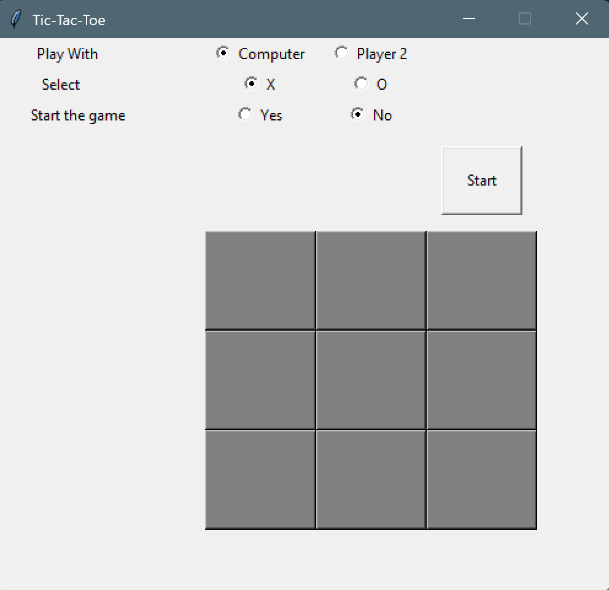

# 🎮 Tic-Tac-Toe Game with GUI (Python + Tkinter)

A fully interactive **Tic-Tac-Toe** game built with **Python** and **Tkinter**, featuring both **Player vs Player** and **Player vs Computer** modes. The computer uses basic strategy logic to make decisions.

## 🧠 Features

- 🆚 Play against another player or the computer  
- ❌🟢 Choose your marker: **X** or **O**  
- ✅ "Ready to play" confirmation before starting  
- 💻 Computer opponent with simple AI strategy:
  - Win if possible
  - Block opponent
  - Choose center if available
  - Choose a corner if possible
- 🎉 Game end detection (Win / Tie)  
- 🔄 Option to play again after each match  
- 🚫 Prevents starting new games while one is in progress  

---

## 📸 Preview

 <!-- Make sure `window.png` is in your repo root -->

---

## 📁 Project Structure

```bash
tic-tac-toe/
│
├── tic_tac_toe.py        # Main game script
├── README.md             # Game description and instructions
├── window.png            # Screenshot of the game (optional)
